# . ݁₊ ⊹ 🥐🍰 ONZE Café App 🧺☕️  ⊹ . ݁˖ . ݁


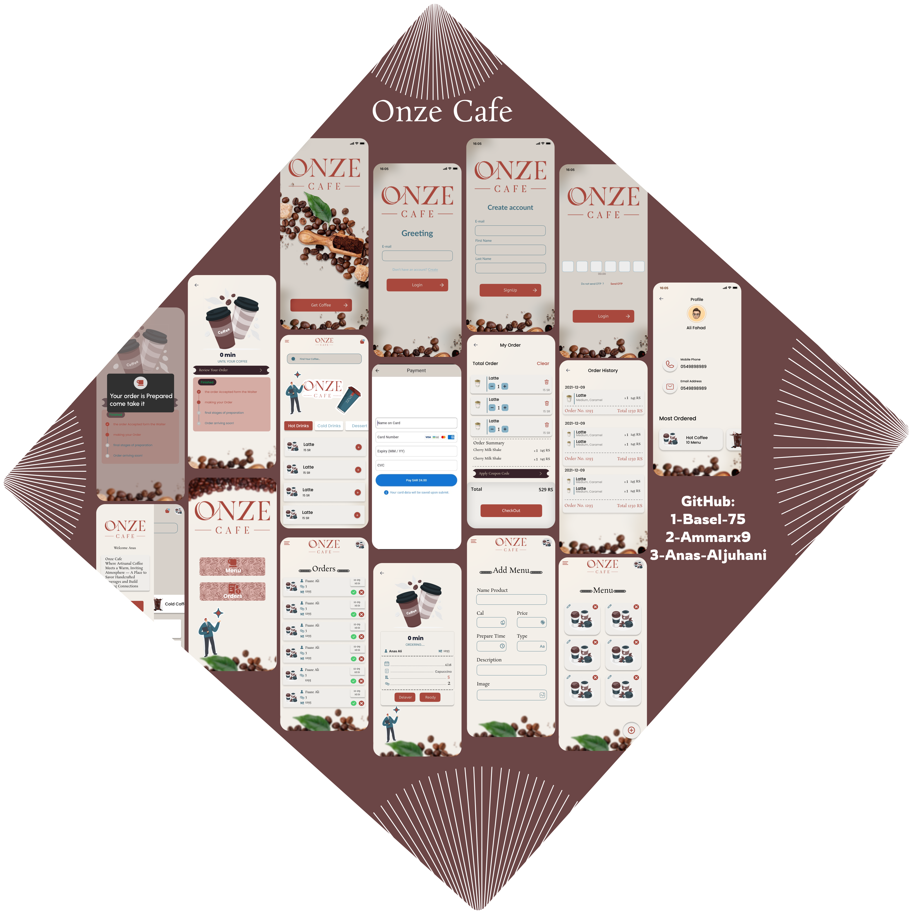

## Overview

### Purpose
The app aims to streamline the ordering process for coffee and desserts, especially during peak times. It allows customers to place their orders through the app, eliminating long wait times. Once the order is prepared, the customer receives a notification that their order is ready for pickup. Additionally, the app includes an admin interface that allows authorized personnel to manage products, accept orders, and remove items as needed, ensuring efficient operations and a seamless customer experience.

### Features
- **Two Apps: Employee App / Customer App**

#### Customer Features
- **Orders**: Customers can browse the available menu, select their preferred coffee or desserts, and place their order directly in the cart.

- **Multiple Orders**: Customers can place multiple orders at once, allowing them to order different items.

- **Order Tracking**: Customers can track the progress of their order and receive notifications when it's ready for pickup.

- **Payment Options**: Multiple payment methods are available, including credit cards, mobile payments, and cash on delivery.

- **Order History**: Users can view their past orders.

- **Search for Products**: Users can quickly find specific items using the search function.

- **Elegant Design**: The design is clean and modern, balancing beauty and simplicity.

- **Authentication**: The app provides login and sign-up functions with OTP from the database.

- **Local Storage**: The app stores and updates items locally.

#### Employee (Admin) Features
- **Product Management**: Admins can add new products or remove products from the menu as needed.

- **Order Management**: Admins can view, accept, manage, or cancel incoming orders, and notify customers when their order is ready.

- **Notifications**: Admins can send custom notifications to customers once an order is finished.


## Widgets & External Packages

### Main Widgets
- **TextField**: The `TextField` widget is used to allow users to input text.

- **SnackBar**: The `SnackBar` is used to show error messages to the users.

- **Tab Bar**: The `TabBar` widget provides a set of tabs for easy navigation between different views . It's often used in combination with `TabBarView` to display corresponding content when a tab is selected.

- **Builder**: The `Builder` widget is used to create a new context for the child widget.

**Drawer**: The `Drawer` widget provides a sliding panel on the side of the screen, It allows users to access different sections of the app.

### External Packages
- **cupertino_icons**: Flutter widgets implementing the current iOS design language.

- **flutter_bloc**: A predictable state management library that helps implement the BLoC (Business Logic Component) design pattern

- **get_it**: A simple Service Locator for Dart and Flutter projects.

- **get_storage**: A fast, extra light, and synchronous key-value in memory, which backs up data to disk at each operation. It is written entirely in Dart and easily integrates with the Get framework of Flutter.

- **pinput**: provides an easy-to-use and customizable Pin code input field. It offers several features such as animated decoration switching, form validation, SMS autofill.


- **Icons Plus**: A package for Flutter developers that provides a collection of attractive icons from different packs.

- **intl**: A package that provides internationalization and localization utilities. It supports formatting dates, numbers.

- **dio**: HTTP networking package for Dart/Flutter, supports Global configuration, Interceptors, FormData, Request cancellation, File uploading/downloading,etc.

- **supabase_flutter**: It provides authentication, database, and storage functionalities to help build secure and scalable apps.

**flutter_dotenv**: allow you to store sensitive configuration details in a `.env` file and access them within your application.

- **buttons_tabbar**: A customizable TabBar widget that includes buttons, providing flexibility for adding icons or text to tabs.

- **custom_radio_grouped_button**: widget that offers custom, grouped radio buttons. It allows for easy styling and selection customization,

- **flutter_stepindicator**: A lightweight package for creating step indicators in Flutter. It is helpful when you need to display progress across multiple steps.

- **lottie**: A package used to display Lottie animations in your Flutter app.

- **moyasar**: A package that integrates Moyasar, an online payment gateway, into Flutter apps.

- **onesignal_flutter**: A library for implementing push notifications in Flutter apps using OneSignal.


- **image_picker**: A tool for picking images from the gallery or camera.

- **uuid**: A package that generates universally unique identifiers (UUIDs) in Dart and Flutter.

## Instructions for Running the App

### Prerequisites
- Flutter SDK

### Running the App
1. Clone the repository: 
   ```bash
   git clone https://github.com/Basel-75/Project-8.git
2. Navigate to the project directory: 
   ```bash
   cd Project-8

3. Install dependencies: 
   ```bash
   flutter pub get

4. Run the app on an emulator or connected device: 
   ```bash
   flutter run


## Output

### Customer App Screenshots 


- **First Screen**:

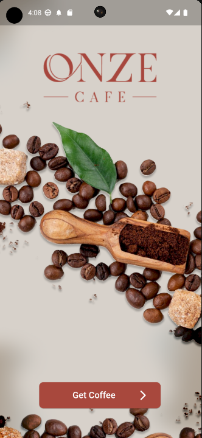

- **Auth Screen**:

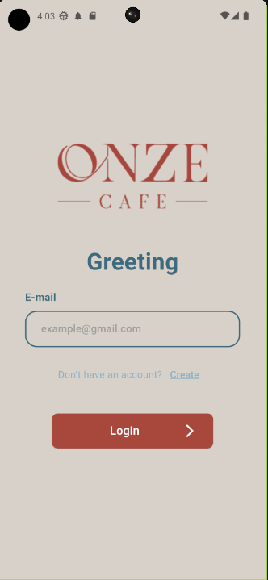
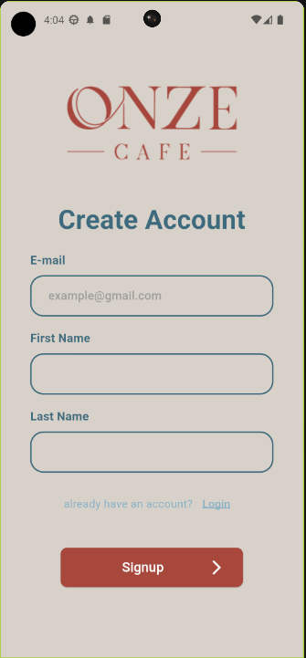
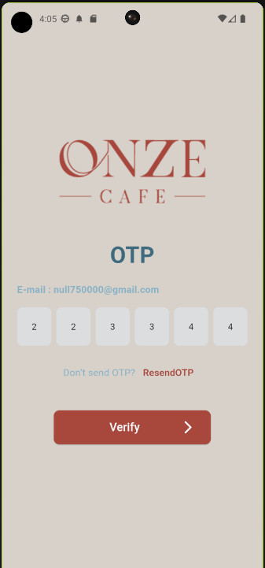

- **Loading State**:

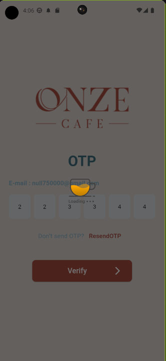


- **Customer Home Screen**:

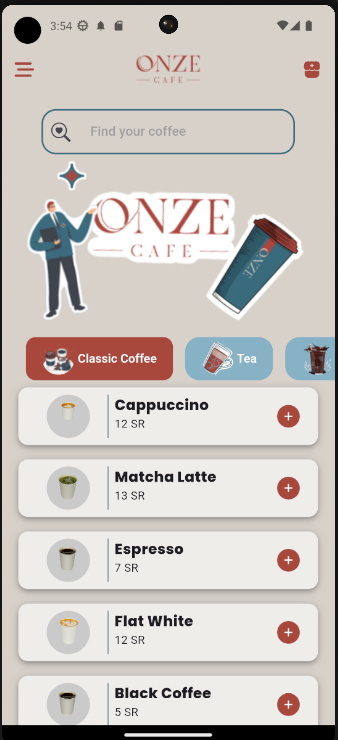

- **Drawer**:

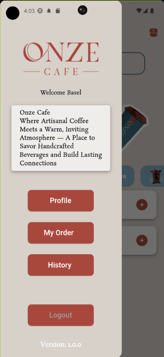

- **Search For Product**:

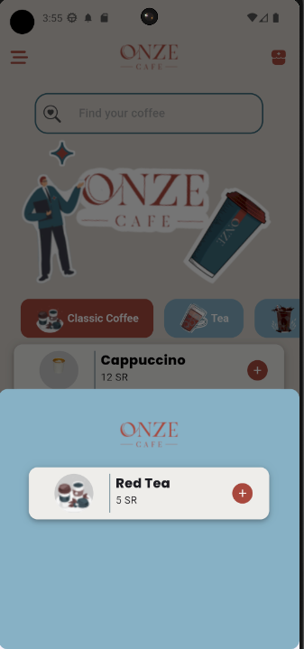

- **Product Info Screen**:

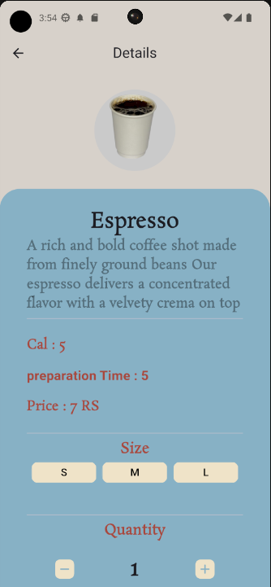


- **Cart Screen**:

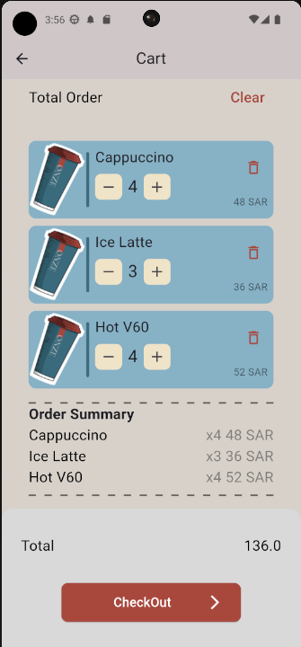

- **History Screen**:

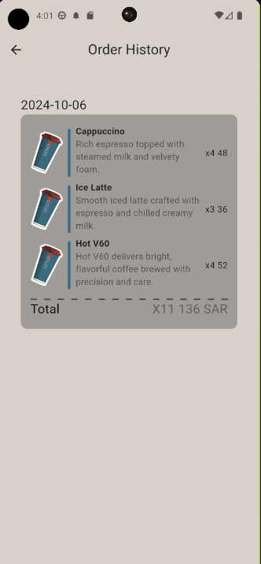

- **My Order Screen**:

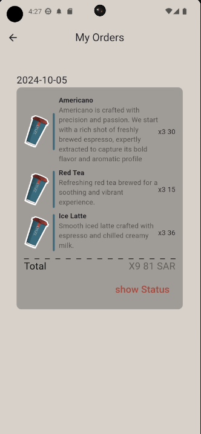

- **Order Status Screen**:

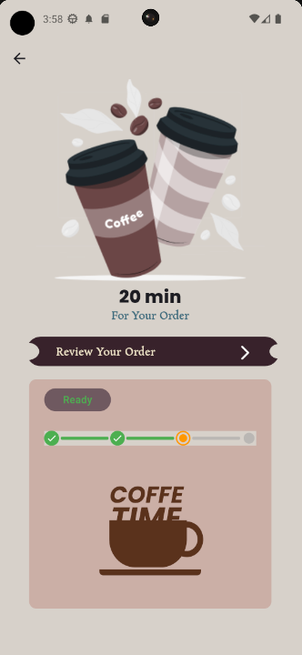

- **Order Status Info**:

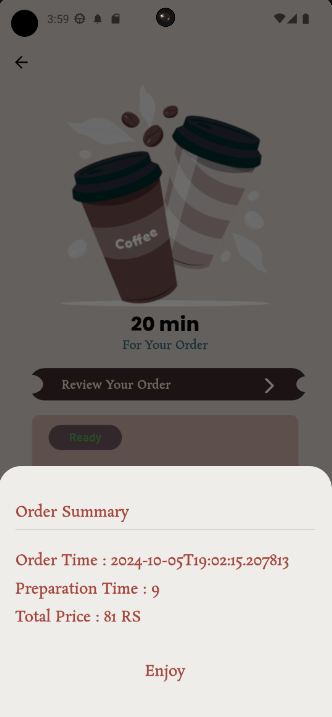

- **Moyasar Payments Screen**:

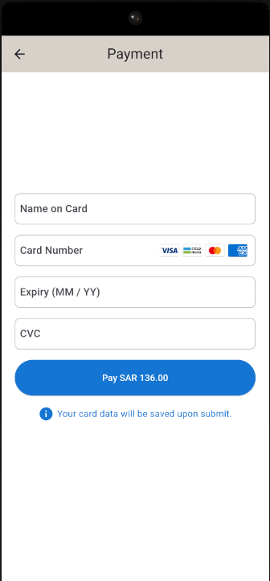

- **Receipt Payment**:

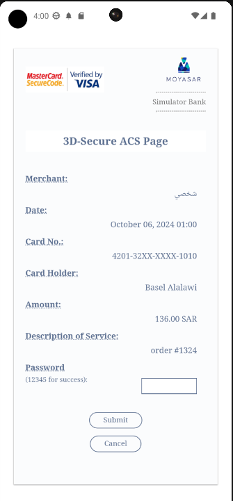

- **Profile Screen**:

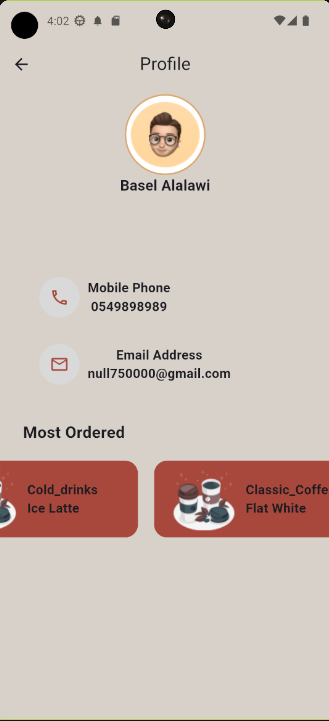

### Employee App Screenshots 

- **Home Screen**:

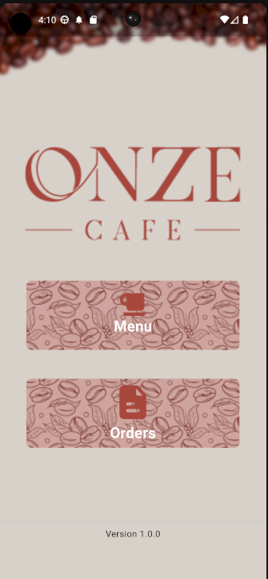

- **Menu Screen**:

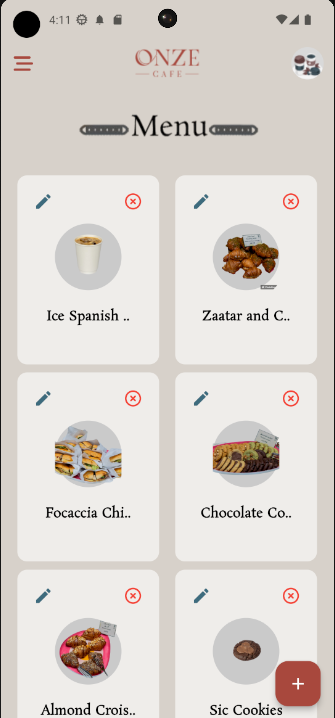

- **Add Menu**:

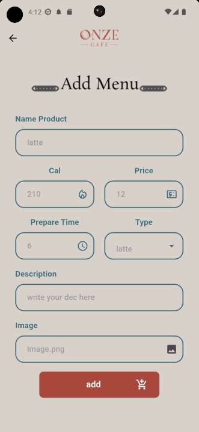


- **Order Screen**:

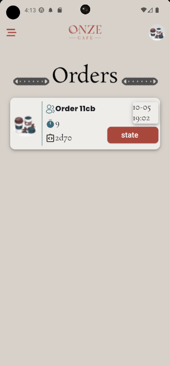

- **Order Customer Status**:

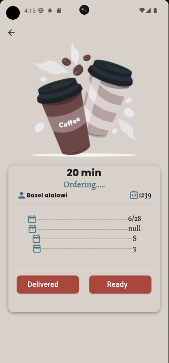

- **Order Info**:

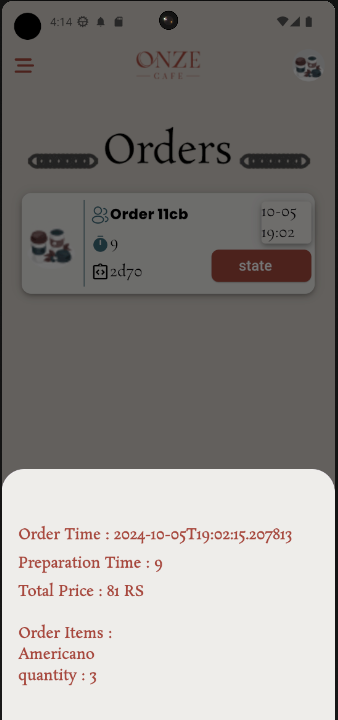

## Team

- [Basel](https://github.com/Basel-75)
- [Anas Aljuhani](https://github.com/Anas-Aljuhani)
- [Ammar](https://github.com/Ammarx9)

## Contact

For more information, feel free to contact me via basel_1422@outlook.com or visit our GitHub profiles:
- [Basel](https://github.com/Basel-75)
- [Anas Aljuhani](https://github.com/Anas-Aljuhani)
- [Ammar](https://github.com/Ammarx9)